# User Experience Design

# App map
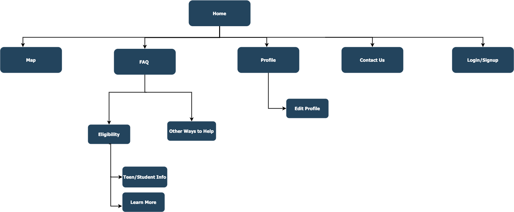

# Prototype
[Click here to view the prototype](https://invis.io/Q312FCGAJ9XV)
 
 * Please note that with this prototype you will only get a you're eligible notification (overlay) if you decide to login from the map, but in reality it will be based on your answers to the eligibility questions for the type of blood donation you would like to make. 
 * Also note that if you go to your profile and select "Find Donation Center" you will not be asked to login again from the map. Once you select a center, you will recieve that first question asking which type of blood donation you would like to make and then from there you will get a notification stating whether ot not you're eligible.

# Wireframe

## Home Page
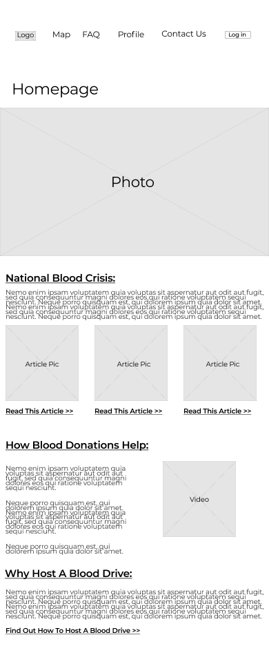

* Gives info about the national blood crisis with links to articles
* Gives info about hoe blood donations help along with some videos
* Gives info about why one should host a blood drive and links to our "Other Ways to Help" page so that users can learn about setting up blood drives

## Map Page
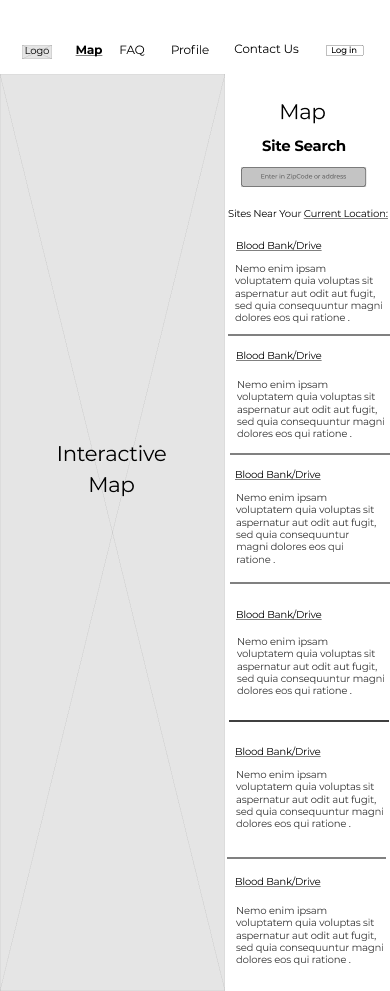

* When clicking on the Map page, a user will be shown blood donation centers and drives close to them. 
* They will also have the option to put in an address or zip code. 
* From there they can select where they would like to go to donate blood. 
* This action triggers an initial process with a series of overlays to determine the user's eligibility based on factors such as age, weight, and current health. (see below)

#### Question 1
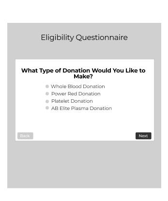

* They will be asked what type of donation they would like to make so that we can determine what questions to ask or if they are logged in we can check to see if they are eligible for that type of donation

#### Question 2
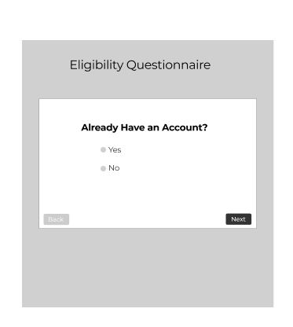

* After being asked what type of donation they would like to make, if they are not logged in they will be asked if they have an account.

#### Question 3
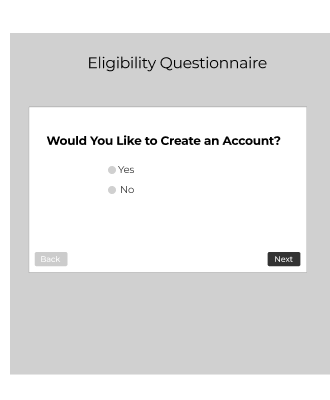

* If the answers no to Question 2, They will be asked if they want to create an account.

#### Eligibility Questionnaire
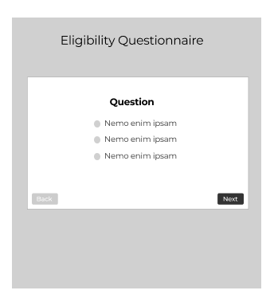

* If the answers no to Question 3, They will given an eligibility quiz based on the type of donation they would like to make.
* Once finished, an overlay will appear telling the user whether or not they're eligible.

#### Login

* If the answers yes to Question 2, an overlay will show allowing them to login.
* Once they login an overlay will appear telling the logged in user whether or not they're eligible (based on profile info and their answer to question 1)

#### Sign Up

* If the answer yes to Question 3, They will be given an overlay to sign up
* Once they sign up, an overlay to the "Eligibility Questionnaire" (above) they will appear.
* Once finished, an overlay will appear telling the user whether or not they're eligible.

#### Eligible Overlay
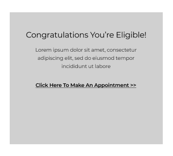

* Based on their answers users will get an overlay notification stating that they are eligible
* The overlay provides a link to the center's website to make an appointment

#### Not Eligible Overlay
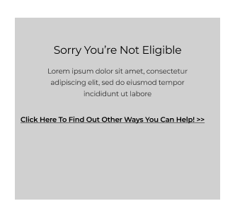
* Based on their answers users will get an overlay notification stating that they are not eligible
* The overlay provides a link to our "Other Ways to Help" page

## FAQ Page
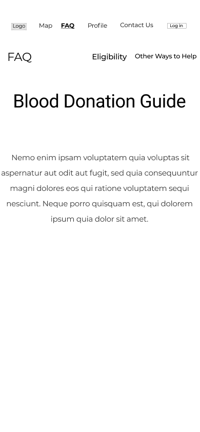

"FAQ" page will provide some general information and have links to the "Eligibility" page and "Other Ways to Help" page

### Eligibility Page
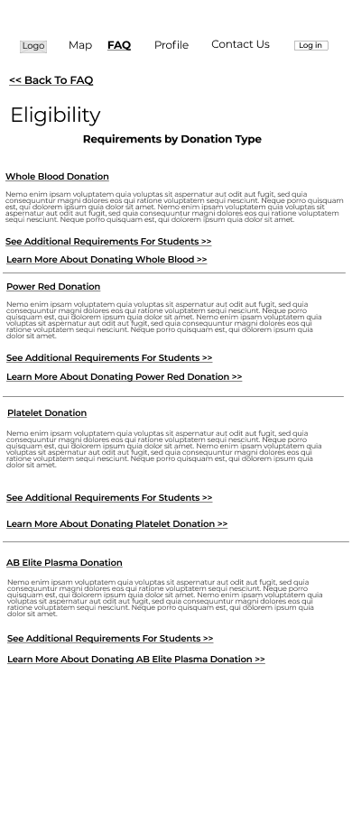

* Gives eligibility requirements based on donation type.
* Include links to a page about "Information for Teen Donors" and a "Learn More" page for each of the donation types

#### Information for Teen Donors
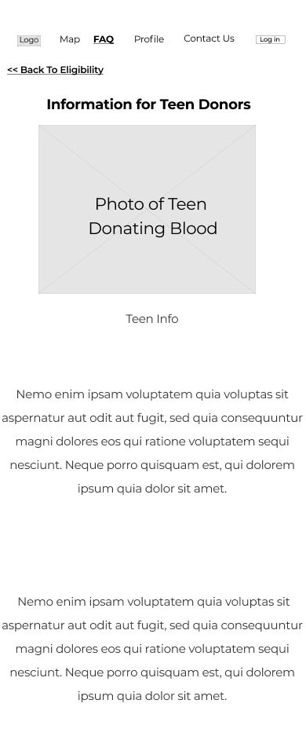

* This will provide general information for teenagers who want to donate blood.

#### Learn More
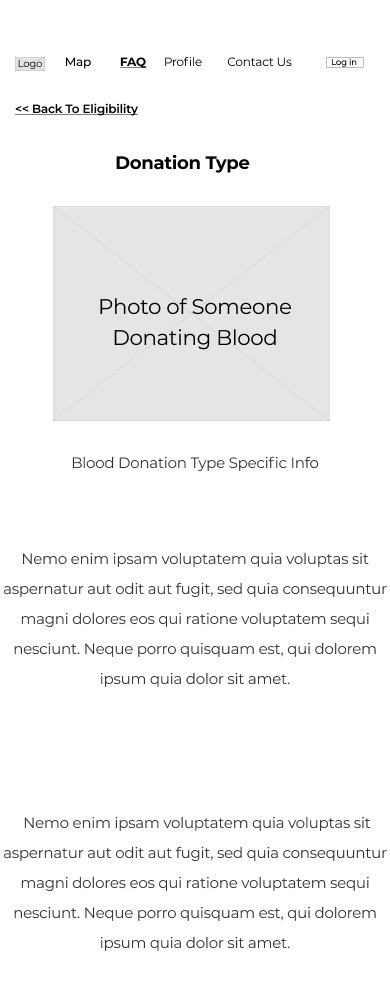

* Each of the blood Donation Types will have a page with the same layout as pictured, which gives information about that specific type of blood donation.
* You can also get to these pages from the "Profile" page by clicking on the type of blood donation that you're elgible for under "You are Eligible for"

## Profile Page
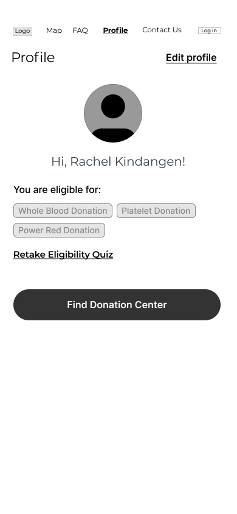

* Allows users to see what types of blood donations they are eligible for.
* It allows them to retake the quiz if their health condition changes.
* Also allows them to find a donation center near them by clicking "Find Donation Center" that links them to the "Map" page
* They can also edit their profile (name, password, picture, email) by clicking "Edit Profile"

### Edit Profile
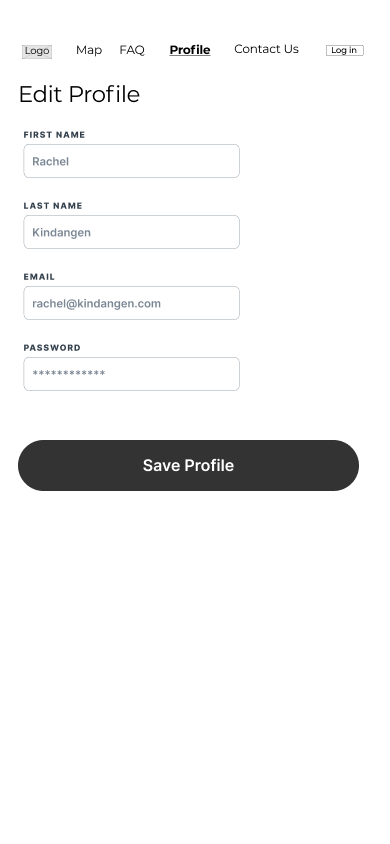

* From the "Profile Page" users can edit their profile info (name, password, picture, email)

## Contact Us

* Contact info of the team
* Also live chat/message option if users have questions. Clicking this opens up a chat/message overlay

#### Chat/Message Overlay
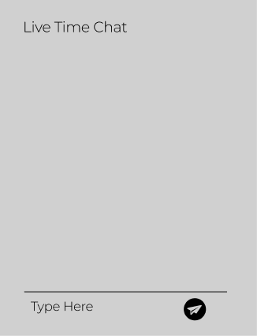

* Overlay for chat that appears when users click message on the Contact Us page.

## Login
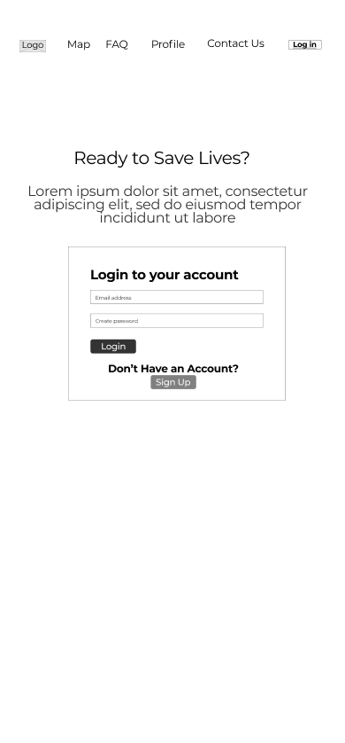

* Users can login or sign up if they do not have an account.
* From the Login page the user will be brought to the "Profile" page

## Sign Up
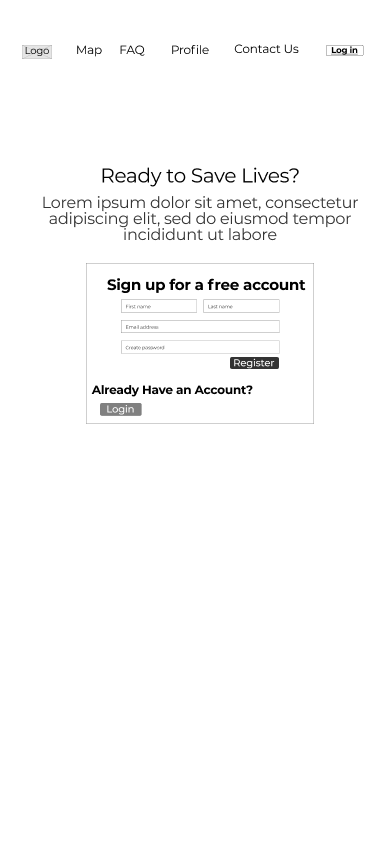

* When clicking login if the user does not have an account they can click “Sign Up” to create an account.
* When you register to sign up you will be brought to the "Eligibility Questionnaire/Quiz" that will help determine which type(s) of blood donation they are eligible for. 

# Eligibility Questionnaire/Quiz
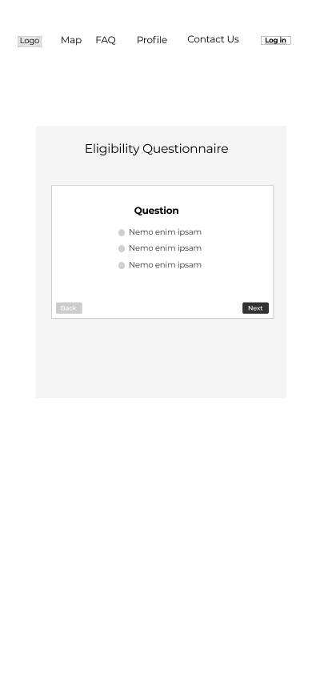

* Upon Sign Up from the main Login/Signup page users will take the "Eligibility Questionnaire/Quiz" that will help determine which type(s) of blood donation they are eligible for.
* Users will also be brought to this page if they go to the "Profile" page and select "Retake Eligibility Quiz"

